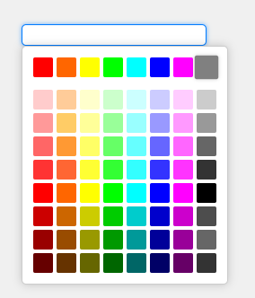

# GridColorPicker

`GridColorPicker` is a JavaScript library that allows users to select colors from a grid. The selected color can be returned in various formats such as HEX, RGB, or RGBA, depending on the configuration.




## Quick Example

```js
const colorPickerElement = document.getElementById("colorPicker");
const gridColorPicker = new GridColorPicker(colorPickerElement, {
  selectType: "hex", // Choose the format: hex, rgb, or rgba
  mainColors: [], // Main colors to display in the picker
  othersColors: [], // Additional colors to display in the picker
  animation: "fade", // Animation type: fade, slide, or none
  itemsPerRow: 8, // Number of items per row in the grid
  defaultColor: "#ffcc00", // Default color to be selected
  autoOpen: true, // Automatically open the picker when initialized
  callback: (selectedColor) => {
    console.log("Selected color:", selectedColor); // Callback function to handle the selected color
  },
});
```

## Options

| Property       | Type       | Description                                                                                                                                                                                                                   |
| -------------- | ---------- | ----------------------------------------------------------------------------------------------------------------------------------------------------------------------------------------------------------------------------- |
| `selectType`   | `string`   | Specifies the format of the selected color. Can be `hex`, `rgb`, or `rgba`.                                                                                                                                                   |
| `mainColors`   | `array`    | An array of colors to display as the main palette. Colors can be in hex, rgb, or rgba format.                                                                                                                                 |
| `othersColors` | `array`    | An array of additional colors to display below the main colors. Colors can be in hex, rgb, or rgba format.                                                                                                                    |
| `animation`    | `string`   | Sets the type of animation when the color picker opens/closes. Can be `"fade"`, `"slide"`, or `"none"`.                                                                                                                       |
| `itemsPerRow`  | `number`   | Specifies how many colors to display per row in the grid. Default is `8`.                                                                                                                                                     |
| `defaultColor` | `string`   | Specifies the default color to be selected when the color picker is initialized. The color can be in `hex`, `rgb`, or `rgba` format, depending on the `selectType` setting. If not provided, no color is selected by default. |
| `autoOpen`     | `boolean`  | Automatically opens the color picker when it is initialized. Default is `false`.                                                                                                                                              |
| `callback`     | `function` | A callback function that is executed when a color is selected. The selected color is passed to this function in the format defined by `selectType`.                                                                           |

### Detailed Option Descriptions:

- **selectType**: Determines the format in which the selected color will be returned. Possible values are:

  - `"hex"` for colors in hexadecimal format (e.g., `#ffcc00`),
  - `"rgb"` for colors in RGB format (e.g., `rgb(255, 204, 0)`),
  - `"rgba"` for colors in RGBA format (e.g., `rgba(255, 204, 0, 1)`).

- **mainColors**: An array containing the main colors that will be displayed at the top of the grid. Each color can be in hex, rgb, or rgba format. This can be an empty array if you don't want to provide predefined colors.

- **othersColors**: An array of additional colors that will be displayed below the main colors. Like `mainColors`, these colors can also be in hex, rgb, or rgba format.

- **animation**: Specifies the type of animation used when opening or closing the color picker. Possible values are:

  - `"fade"`: The color picker will fade in and out.
  - `"slide"`: The color picker will slide in and out.
  - `"none"`: No animation will be applied when the color picker opens or closes.

- **itemsPerRow**: Specifies how many colors (items) will be displayed in each row of the grid. The default value is `8`.

- **defaultColor**: Specifies the default color to be selected when the color picker is initialized. The color can be in `hex`, `rgb`, or `rgba` format, depending on the `selectType` setting. If not provided, no color is selected by default.

- **autoOpen**: A boolean option that, if set to `true`, will automatically open the color picker when it is initialized. By default, this option is set to `false`.

- **callback**: A function that is triggered when a user selects a color from the grid. The selected color is passed as an argument to the callback, and it will be in the format defined by `selectType`.

## Functions

The `GridColorPicker` object also provides some useful methods to control the color picker:

| Function   | Description                                             | Returns                           |
| ---------- | ------------------------------------------------------- | --------------------------------- |
| `open()`   | Opens the color picker dialog/modal programmatically.   | `null`                            |
| `close()`  | Closes the color picker dialog/modal programmatically.  | `null`                            |
| `isOpen()` | Checks if the color picker is currently open or closed. | `true` if open, `false` if closed |

### Function Descriptions:

- **open()**: Opens the color picker dialog, allowing users to select a color.
- **close()**: Closes the color picker dialog.
- **isOpen()**: Returns a boolean value indicating whether the color picker is currently open (`true`) or closed (`false`).

## Example of Using the Functions

```js
// Open the color picker programmatically
gridColorPicker.open();

// Close the color picker programmatically
gridColorPicker.close();

// Check if the color picker is open
const isPickerOpen = gridColorPicker.isOpen();
console.log("Is picker open:", isPickerOpen);
```
